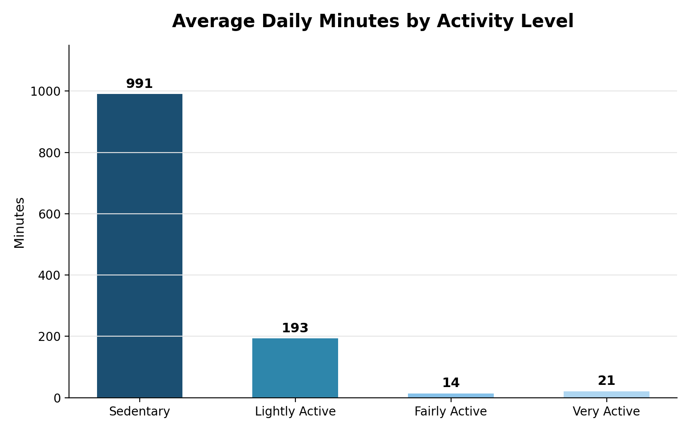
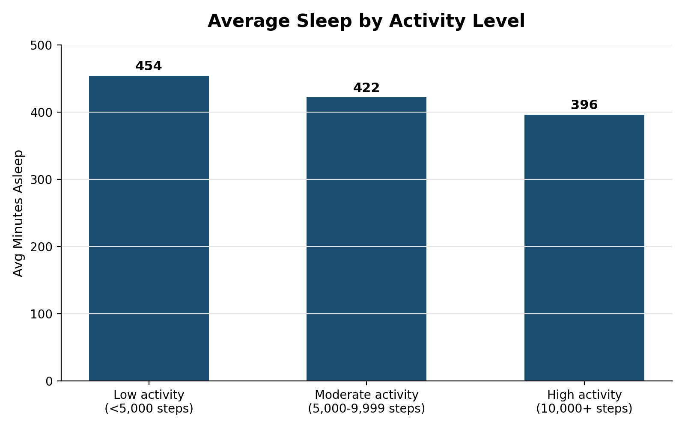
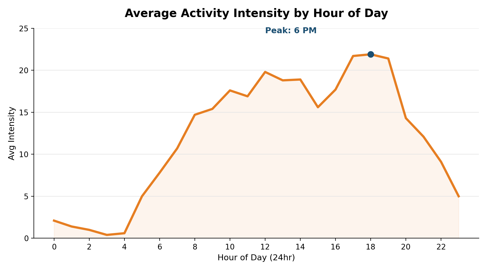

# Bellabeat Smart Device Usage Analysis

A data analysis case study exploring FitBit fitness tracker data to uncover smart device usage trends, and using those insights to guide marketing strategy for **Bellabeat Time**.

## Business Task

This analysis examines FitBit fitness tracker data to uncover trends in how people use smart devices to track daily activity and sleep. These insights are used to recommend marketing strategies for Bellabeat's **Time** smart watch, helping position the product based on real-world usage habits.

**Guiding questions:**
- What are some trends in smart device usage?
- How could these trends apply to Bellabeat customers?
- How could these trends help influence Bellabeat's marketing strategy?

## Tools Used

- **BigQuery (SQL)** — data cleaning, transformation, and analysis
- **Excel** — data visualization
- **FitBit Fitness Tracker Data** (CC0: Public Domain, via Mobius on Kaggle)

## Data Source

33 FitBit users, tracked April 12 – May 12, 2016. Six tables covering daily activity, sleep, hourly steps, hourly calories, hourly intensities, and weight logs.

## Data Cleaning

- Removed 3 duplicate rows from the sleep data
- Standardized two mixed date/time formats into clean datetime fields (zero data loss across 22,000+ rows)
- Assessed data completeness across all 6 tables — activity/steps/calories/intensity data was 100% complete; sleep data covered 73% of users; weight data covered only 24% and was excluded from the core analysis

## Key Findings

### 1. Users are highly sedentary
Users average **991 sedentary minutes/day (~16.5 hrs)**, compared to just 35 combined minutes of fairly/very active movement.

### 2. More active users sleep less
Days with 10,000+ steps average **396 minutes of sleep**, about an hour less than low-activity days (454 minutes).

### 3. Activity peaks sharply between 5–7 PM
Intensity is lowest overnight and peaks clearly in the early evening, with **6 PM** as the single most active hour.

## Recommendations

1. **Market achievable, everyday movement** — Position Time around gentle nudges (e.g., hourly stand-up reminders) rather than intense fitness metrics, since most users aren't athletes.
2. **Promote sleep + activity balance** — Highlight Time's combined tracking feature, with wind-down notifications on high-activity days to help protect sleep.
3. **Target the 5–7 PM engagement window** — Send a motivational nudge at 5 PM, an appreciation note at 7 PM, and surface membership promotions during this peak window.

## Limitations

- Small sample size (33 users)
- Data is roughly a decade old (2016)
- No demographic data available (age, gender)
- Sleep data covers 73% of users; weight data only 24%

## Full Deliverables

- [Full Report (Word)](Bellabeat_Case_Study_Report.docx)
- [Presentation Deck (PowerPoint)](Bellabeat_Case_Study_Deck.pptx)
